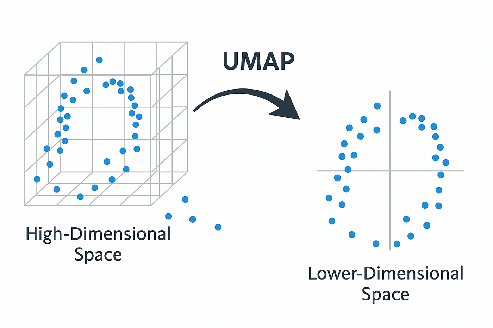
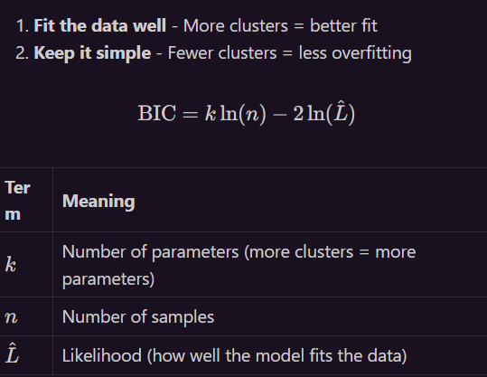

# Raptor Architecture

#### Reducing dimensionality of embeddings from ~760 to 10 dimensions
- I use UMAP as my primary way of doing this, but if I dont have enough chunks, it doesnt have enough data to work with
- UMAP takes many chunks at once and reduces them all at once by detecing similarities in their data and removing redundencies
- 
- 
- Fallback is PCA, which is worse because it only detects linear patterns
- I added warnings to make sure that we try to have at least 15 chunks for umap to work

#### Finding the optimal number of clusters using BIC (Bayesian Information Criterion)
- It answers the question, how many clusters should I use?
- 